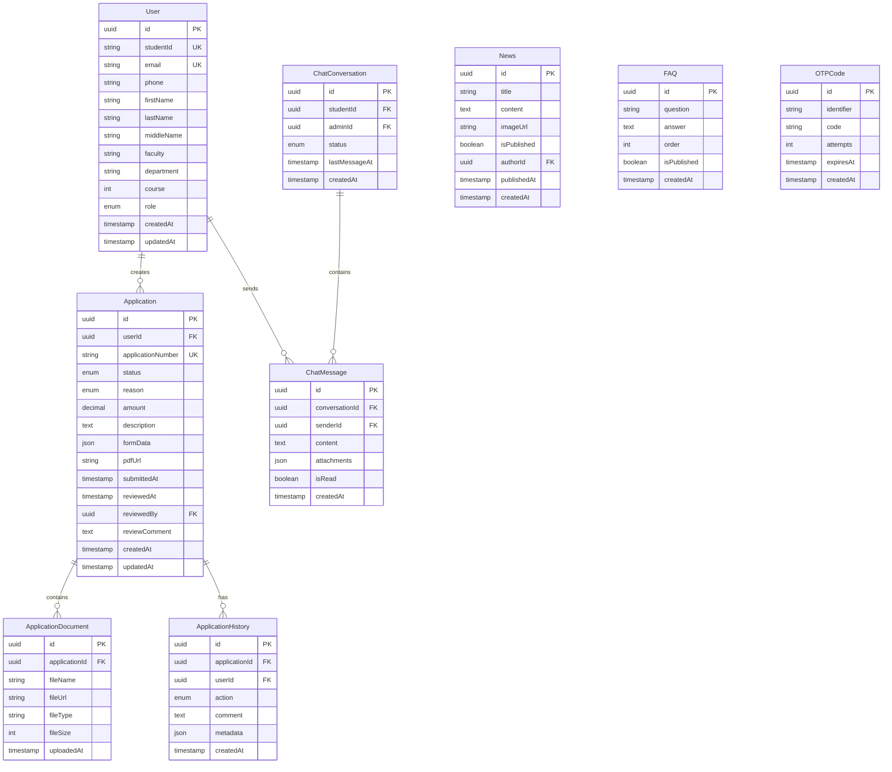

# Архитектура проекта: Система управления материальной помощью

## Оглавление
1. [Общий обзор](#общий-обзор)
2. [Технологический стек](#технологический-стек)
3. [Структура проекта](#структура-проекта)
4. [Архитектура компонентов](#архитектура-компонентов)
5. [Архитектура данных](#архитектура-данных)
6. [API архитектура](#api-архитектура)
7. [Система аутентификации](#система-аутентификации)
8. [Безопасность](#безопасность)
9. [Производительность и масштабирование](#производительность-и-масштабирование)

---

## Общий обзор

### Цель проекта
Enterprise-уровень веб-приложение для управления заявками на материальную помощь в университете с глубокой аналитикой, автоматизацией документооборота и бесшовным UX.

### Ключевые принципы
- **Модульность**: Каждый компонент и модуль изолирован и переиспользуем
- **Type Safety**: 100% TypeScript coverage
- **Performance First**: Core Web Vitals >= 90
- **Progressive Enhancement**: Graceful degradation для старых браузеров
- **Accessibility**: WCAG 2.1 AA compliance

---

## Технологический стек

### Frontend
```typescript
{
  "framework": "Next.js 14.1+ (App Router)",
  "language": "TypeScript 5.3+",
  "styling": [
    "Tailwind CSS 3.4+",
    "CSS Modules",
    "Framer Motion"
  ],
  "state": {
    "global": "Zustand 4.5+",
    "server": "TanStack Query (React Query) 5.0+",
    "forms": "React Hook Form 7.49+"
  },
  "ui": [
    "Radix UI (headless components)",
    "Lucide React (icons)",
    "Recharts (analytics)",
    "@react-pdf/renderer (PDF generation)"
  ],
  "realtime": "Socket.io-client 4.6+"
}
```

### Backend
```typescript
{
  "runtime": "Node.js 20 LTS",
  "framework": "Express 4.18+ или Next.js API Routes",
  "language": "TypeScript 5.3+",
  "database": "PostgreSQL 16+",
  "orm": "Prisma 5.8+",
  "cache": "Redis 7.2+",
  "realtime": "Socket.io 4.6+",
  "auth": "JWT + OTP (node-otp)",
  "fileStorage": "AWS S3 / MinIO"
}
```

### DevOps
```yaml
containerization: Docker + Docker Compose
ci_cd: GitHub Actions
monitoring: Sentry, LogRocket
analytics: PostHog / Mixpanel
testing:
  - unit: Vitest
  - integration: Playwright
  - e2e: Playwright
```

---

## Структура проекта

```
aid-management-platform/
├── apps/
│   ├── web/                          # Next.js приложение
│   │   ├── app/                      # App Router
│   │   │   ├── (auth)/              # Auth группа
│   │   │   │   ├── login/
│   │   │   │   └── verify-otp/
│   │   │   ├── (dashboard)/         # Protected routes
│   │   │   │   ├── student/
│   │   │   │   │   ├── dashboard/
│   │   │   │   │   ├── applications/
│   │   │   │   │   ├── new-application/
│   │   │   │   │   ├── chat/
│   │   │   │   │   └── news/
│   │   │   │   └── admin/
│   │   │   │       ├── dashboard/
│   │   │   │       ├── applications/
│   │   │   │       ├── analytics/
│   │   │   │       ├── content/
│   │   │   │       └── chat/
│   │   │   ├── api/                 # API Routes
│   │   │   │   ├── auth/
│   │   │   │   ├── applications/
│   │   │   │   ├── users/
│   │   │   │   ├── analytics/
│   │   │   │   ├── chat/
│   │   │   │   └── upload/
│   │   │   ├── layout.tsx           # Root layout
│   │   │   └── page.tsx             # Landing page
│   │   ├── components/
│   │   │   ├── ui/                  # Base UI components
│   │   │   │   ├── button.tsx
│   │   │   │   ├── card.tsx
│   │   │   │   ├── input.tsx
│   │   │   │   ├── modal.tsx
│   │   │   │   ├── slide-over.tsx
│   │   │   │   ├── table.tsx
│   │   │   │   ├── skeleton.tsx
│   │   │   │   └── ...
│   │   │   ├── shared/              # Shared components
│   │   │   │   ├── Header.tsx
│   │   │   │   ├── Sidebar.tsx
│   │   │   │   ├── Footer.tsx
│   │   │   │   └── ThemeToggle.tsx
│   │   │   ├── dashboard/           # Dashboard widgets
│   │   │   │   ├── StatCard.tsx
│   │   │   │   ├── Chart.tsx
│   │   │   │   ├── RecentApplications.tsx
│   │   │   │   └── ...
│   │   │   ├── applications/        # Application components
│   │   │   │   ├── ApplicationForm.tsx
│   │   │   │   ├── ApplicationTable.tsx
│   │   │   │   ├── ApplicationDetails.tsx
│   │   │   │   ├── PDFPreview.tsx
│   │   │   │   └── ...
│   │   │   └── chat/               # Chat components
│   │   │       ├── ChatWindow.tsx
│   │   │       ├── MessageList.tsx
│   │   │       └── ...
│   │   ├── lib/
│   │   │   ├── api/                # API client functions
│   │   │   ├── hooks/              # Custom React hooks
│   │   │   ├── stores/             # Zustand stores
│   │   │   ├── utils/              # Utility functions
│   │   │   ├── validations/        # Zod schemas
│   │   │   └── constants.ts
│   │   ├── styles/
│   │   │   ├── globals.css
│   │   │   └── themes.css
│   │   ├── public/
│   │   ├── prisma/
│   │   │   └── schema.prisma
│   │   ├── types/
│   │   │   ├── api.types.ts
│   │   │   ├── database.types.ts
│   │   │   └── ...
│   │   ├── middleware.ts           # Next.js middleware
│   │   ├── next.config.js
│   │   ├── tailwind.config.ts
│   │   ├── tsconfig.json
│   │   └── package.json
│   │
│   └── api/                         # (Optional) Standalone API server
│       ├── src/
│       │   ├── controllers/
│       │   ├── services/
│       │   ├── middleware/
│       │   ├── routes/
│       │   ├── models/
│       │   ├── config/
│       │   └── index.ts
│       ├── Dockerfile
│       └── package.json
│
├── packages/                        # Shared packages (monorepo)
│   ├── ui/                         # Shared UI components
│   ├── types/                      # Shared TypeScript types
│   ├── utils/                      # Shared utilities
│   └── config/                     # Shared configs
│
├── docs/
│   ├── API.md
│   ├── DESIGN_SYSTEM.md
│   ├── DATABASE.md
│   └── DEPLOYMENT.md
│
├── scripts/
│   ├── seed.ts
│   ├── migrate.ts
│   └── setup.sh
│
├── docker-compose.yml
├── .env.example
├── .gitignore
├── turbo.json                      # Turborepo config (если monorepo)
└── README.md
```

---

## Архитектура компонентов

### Слоистая архитектура UI

```
┌─────────────────────────────────────────┐
│         Presentation Layer              │
│    (Pages & Route Components)           │
└──────────────┬──────────────────────────┘
               │
┌──────────────▼──────────────────────────┐
│         Container Layer                  │
│    (Smart Components with Logic)        │
└──────────────┬──────────────────────────┘
               │
┌──────────────▼──────────────────────────┐
│         UI Component Layer              │
│    (Dumb/Presentational Components)     │
└──────────────┬──────────────────────────┘
               │
┌──────────────▼──────────────────────────┐
│         Base UI Layer                   │
│    (Primitive Components: Button, Input)│
└─────────────────────────────────────────┘
```

### Компонентная структура (Atomic Design)

**Atoms** (Базовые элементы)
- Button, Input, Label, Badge, Icon
- Полностью переиспользуемые, без бизнес-логики

**Molecules** (Комбинации атомов)
- FormField (Label + Input + Error)
- SearchBar (Input + Icon + Button)
- StatCard (Icon + Text + Number)

**Organisms** (Сложные компоненты)
- Header, Sidebar, ApplicationForm
- DashboardWidget, DataTable

**Templates** (Макеты страниц)
- DashboardLayout, AuthLayout
- AdminLayout, StudentLayout

**Pages** (Готовые страницы)
- StudentDashboard, AdminAnalytics
- ApplicationSubmission

### Паттерны компонентов

```typescript
// Compound Component Pattern
<Select>
  <Select.Trigger>
    <Select.Value placeholder="Выберите..." />
  </Select.Trigger>
  <Select.Content>
    <Select.Item value="1">Опция 1</Select.Item>
  </Select.Content>
</Select>

// Render Props Pattern
<DataFetcher
  url="/api/applications"
  render={({ data, loading, error }) => (
    <ApplicationTable data={data} />
  )}
/>

// Custom Hooks Pattern
const { data, loading, error, refetch } = useApplications({
  status: 'pending',
  page: 1
});
```

---

## Архитектура данных

### Entity-Relationship Diagram (ERD)



### Prisma Schema (подробнее в DATABASE.md)

---

## API архитектура

### RESTful API Endpoints

#### Authentication
```
POST   /api/auth/send-otp           # Отправить OTP код
POST   /api/auth/verify-otp         # Верифицировать OTP
POST   /api/auth/refresh            # Обновить access token
POST   /api/auth/logout             # Выход
GET    /api/auth/me                 # Получить текущего пользователя
```

#### Applications
```
GET    /api/applications            # Список заявок (с фильтрами)
POST   /api/applications            # Создать заявку
GET    /api/applications/:id        # Детали заявки
PATCH  /api/applications/:id        # Обновить заявку
DELETE /api/applications/:id        # Удалить заявку (только черновики)
POST   /api/applications/:id/submit # Подать заявку
PATCH  /api/applications/:id/review # Рассмотреть заявку (admin)
GET    /api/applications/:id/pdf    # Скачать PDF
POST   /api/applications/:id/documents # Загрузить документы
```

#### Analytics (Admin)
```
GET    /api/analytics/overview      # Общая статистика
GET    /api/analytics/trends        # Тренды по периодам
GET    /api/analytics/distributions # Распределения по категориям
GET    /api/analytics/export        # Экспорт данных
```

#### Chat
```
GET    /api/chat/conversations      # Список диалогов
POST   /api/chat/conversations      # Начать диалог
GET    /api/chat/conversations/:id/messages # Сообщения диалога
POST   /api/chat/conversations/:id/messages # Отправить сообщение
PATCH  /api/chat/messages/:id/read  # Отметить прочитанным
```

#### Content Management
```
GET    /api/news                    # Список новостей
POST   /api/news                    # Создать новость (admin)
PATCH  /api/news/:id                # Обновить новость (admin)
DELETE /api/news/:id                # Удалить новость (admin)

GET    /api/faq                     # Список FAQ
POST   /api/faq                     # Создать FAQ (admin)
PATCH  /api/faq/:id                 # Обновить FAQ (admin)
DELETE /api/faq/:id                 # Удалить FAQ (admin)
```

#### File Upload
```
POST   /api/upload                  # Загрузить файл
DELETE /api/upload/:key             # Удалить файл
```

### WebSocket Events (Socket.io)

```typescript
// Client -> Server
'chat:join'              // Присоединиться к диалогу
'chat:leave'             // Покинуть диалог
'chat:send_message'      // Отправить сообщение
'chat:typing'            // Начать печатать

// Server -> Client
'chat:message'           // Новое сообщение
'chat:typing_indicator'  // Индикатор печати
'chat:message_read'      // Сообщение прочитано
'application:status_changed' // Статус заявки изменен
```

### API Response Format

```typescript
// Success Response
{
  success: true,
  data: any,
  meta?: {
    page: number,
    limit: number,
    total: number,
    totalPages: number
  }
}

// Error Response
{
  success: false,
  error: {
    code: string,
    message: string,
    details?: any
  }
}
```

---

## Система аутентификации

### OTP Flow

```
┌────────┐                    ┌────────┐                    ┌────────┐
│ Client │                    │ Server │                    │ Email/ │
│        │                    │        │                    │  SMS   │
└───┬────┘                    └───┬────┘                    └───┬────┘
    │                             │                             │
    │ 1. POST /auth/send-otp      │                             │
    │  { identifier: "email" }    │                             │
    ├────────────────────────────►│                             │
    │                             │                             │
    │                             │ 2. Generate 6-digit OTP     │
    │                             │    Store in Redis (5 min)   │
    │                             │                             │
    │                             │ 3. Send OTP                 │
    │                             ├────────────────────────────►│
    │                             │                             │
    │ 4. { success: true }        │                             │
    │◄────────────────────────────┤                             │
    │                             │                             │
    │ 5. POST /auth/verify-otp    │                             │
    │  { identifier, code }       │                             │
    ├────────────────────────────►│                             │
    │                             │                             │
    │                             │ 6. Verify OTP               │
    │                             │    Generate JWT tokens      │
    │                             │                             │
    │ 7. {                        │                             │
    │   accessToken,              │                             │
    │   refreshToken,             │                             │
    │   user                      │                             │
    │ }                           │                             │
    │◄────────────────────────────┤                             │
    │                             │                             │
```

### JWT Token Strategy

```typescript
// Access Token (short-lived: 15 minutes)
{
  userId: string,
  role: 'student' | 'admin',
  exp: number
}

// Refresh Token (long-lived: 7 days)
{
  userId: string,
  tokenVersion: number,
  exp: number
}
```

### Authorization Middleware

```typescript
// Route protection levels
- Public: Доступно всем
- Authenticated: Требует валидный access token
- Role-based: Требует определенную роль (admin/student)
- Owner: Требует владения ресурсом
```

---

## Безопасность

### Принципы безопасности

1. **Input Validation**
   - Валидация на клиенте (React Hook Form + Zod)
   - Валидация на сервере (Zod schemas)
   - Sanitization всех пользовательских данных

2. **Authentication & Authorization**
   - OTP с rate limiting (max 3 попытки за 5 минут)
   - JWT tokens с коротким временем жизни
   - Refresh token rotation
   - CSRF protection

3. **Data Protection**
   - HTTPS only в production
   - Encrypted database connections
   - Secure file storage (signed URLs)
   - PII encryption at rest

4. **Rate Limiting**
   ```typescript
   - Auth endpoints: 5 req/min
   - API endpoints: 100 req/min
   - File uploads: 10 req/hour
   ```

5. **Headers & CSP**
   ```typescript
   {
     'X-Frame-Options': 'DENY',
     'X-Content-Type-Options': 'nosniff',
     'X-XSS-Protection': '1; mode=block',
     'Strict-Transport-Security': 'max-age=31536000',
     'Content-Security-Policy': '...'
   }
   ```

---

## Производительность и масштабирование

### Performance Optimizations

**Frontend**
- Code splitting по роутам
- Dynamic imports для тяжелых компонентов
- Image optimization (next/image)
- Font optimization (next/font)
- Memoization (React.memo, useMemo, useCallback)
- Virtual scrolling для больших списков

**Backend**
- Database indexing
- Query optimization (Prisma optimization)
- Redis caching (страницы, API responses)
- Connection pooling
- Background jobs для тяжелых операций

**CDN & Caching**
```
- Static assets: CloudFront/CloudFlare
- API responses: Redis (TTL strategies)
- Browser cache: Aggressive caching headers
```

### Масштабирование

**Horizontal Scaling**
```yaml
Load Balancer (Nginx)
├── App Server 1 (Docker container)
├── App Server 2 (Docker container)
└── App Server N (Docker container)
```

**Database Scaling**
- Read replicas для аналитических запросов
- Connection pooling (PgBouncer)
- Partitioning по датам (applications table)

**Caching Strategy**
```
L1: Browser Cache
L2: CDN Cache
L3: Redis Cache
L4: Database Query Cache
```

---

## Мониторинг и логирование

### Метрики
- Response time (P50, P95, P99)
- Error rate
- Request rate
- Database query performance
- Memory/CPU usage

### Логирование
```typescript
{
  level: 'info' | 'warn' | 'error',
  timestamp: ISO8601,
  requestId: UUID,
  userId?: UUID,
  service: string,
  message: string,
  metadata: object
}
```

### Алерты
- Error rate > 1%
- Response time P95 > 2s
- Database connection pool exhausted
- Disk usage > 80%

---

## Дальнейшие улучшения

1. **GraphQL API** для более гибкого fetching
2. **Server Components** (React Server Components) для улучшения производительности
3. **Progressive Web App (PWA)** для offline functionality
4. **Mobile apps** (React Native)
5. **AI/ML** для автоматической классификации заявок
6. **Multi-tenancy** для других университетов

---

## Связанные документы

- [Design System](./DESIGN_SYSTEM.md)
- [Database Schema](./DATABASE.md)
- [API Documentation](./API.md)
- [Deployment Guide](./DEPLOYMENT.md)
- [Development Roadmap](./ROADMAP.md)
